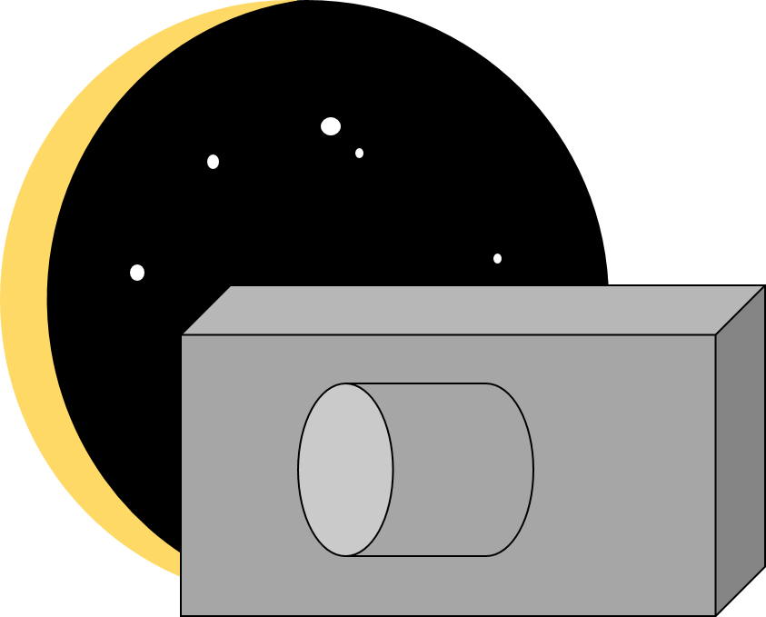

    
    

# Picastro
## An **astrophotography planning** program

Picastro is an *easy-to-use* astrophotography planning program.

## Setup environnement for **Picastro**

In order to run **Picastro** (as it is mainly written in **C++**), you need a c++ compiler (like **GCC** or **LCC**) pre-installed.
Then, **build** and **run** the file *main.cpp*.

## What can **Picastro** do ?

For now, it is able to
- Predict preferable **focal length** for a given angle
- Calculate the "sight angle" of your sensor
- Predict preferable **exposure time**
- Calculate **sampling**

## How to *use* **Picastro** ?

**Picastro** will ask you some questions to calculate as many things as he can about your photo settings, such as exposure time, prefereable focal lenght ...

> But **be aware** that Picastro will **not teach** you astrophotography, it is just here to help 😉 !
